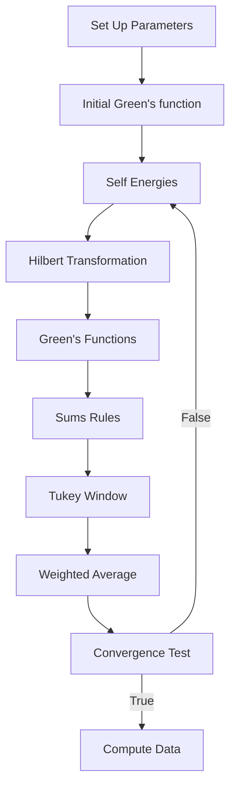

# 2DECFL2ndOrder
The $t$ - $J$ model in two dimensions is consider to be of fundamental to understanding the strongly correlated matter, including high $T_c$ superconductors. In a nutshell *extremely correlated Fermi liquid* (ECFL) theory is an analytically method that uses Schwinger's technique of functional differential equations to obtain a Green's function that captures the physics of very strong correlations of lattice Fermions in the $t$ - $J$ model[^2].  

This progam computes the one-electron Green's function characterized by two-dimensional ECFL theory to 2nd order in the [$\lambda$ expansion](https://doi.org/10.1016/j.aop.2015.03.010) as detailed in Ref.[^1]. 

This program follows the minimal theory for two-dimensional ECFL as explored in Ref.[^2].  This program has been benchmarked in several studies including one on the elastoresistivity of very strongly correlated metals in two-dimensions as seen in Ref.[^3], the dielectic response in two-dimensional strongly correlated metals as shown in Ref.[^4], and the normal-state resistivity of cuprate superconductors (see Ref.[^5]). 


# The spectral function of ECLF theory


# System Requirements
This program requires the [GNU gsl](https://www.gnu.org/software/gsl/) package and Intel MKL package included with [Intel Parallel Studio XE package.](https://www.intel.com/content/www/us/en/developer/articles/guide/download-documentation-intel-parallel-studio-xe-current-previous.html)  


#  Compilation


The program uses the **icc** compiler. The **icc** compiler is included in the intel Parallel Studio XE download.  To compile, run the following command in a terminal emulator. The makefile will have to be manually set up to properly link to the gsl and mkl packages on your system. 
```bash
$ make CompRhoGParams

```

 
# Usage
$d$, the exponent for the frequency grid 
$N_\omega = 2^d$ is the size of $\omega$, the frequency grid
$N_k$ is the number lattice site per dimension
$n_d$ is the electron density per site
$\tau$ is the natural temperature (units $t$)
$t$ is the first neighbor hopping parameter
$t'$, i.e. $tp$, is the second neighbor hopping parameter (units $t$) 
$t''$, i.e., $tpp$, is the third neighbor hopping parameter (units $t$)
$J$ is the value of the exchange parameter (units $t$)
$\mu'$, i.e. $mup$,  is first chemical potential (units $t$)
$u_0$, i.e. $u0$, is second chemical potential (units $t$)
$dom$ is the size of the $\omega$ domain


### To run the program 
```bash
# parameter set
# d Nk nd tau tp tpp J mup u0 neta dom 

$ params.out "12 16 0.75 0.057 -0.2 0.0 0.17 -0.78 0.69 7 20"

```


### Package Breakdown


**files in package**
File Name | Description 
----- | ----
C_extension.h | Definitions and utility functions that build on the standard C library | N/A
CompRhoGchi.c | Main program 
CompRhoGchiParams.c | Variant of Main program that takes parameters as arguments
ConvolutionchiBubWW.h | Defines the function to compute $\chi_{WW}$
ConvolutionchiBubrhorho.h | Defines function to computer $\chi_{\rho\rho}$
HilbertTransformC2CDFTI.h | A variant form of the Hilbert Transform using C2C DFTI
HilbertTransformR2CDFTI.h | A variant of the Hilbert Transform using R2C DFTI
fftw_extension.h | Definitions and utility functions that build on the fftw library
Functionschi.h | Functions specific to the main program
go.sh | A bash script to run batches of the program with different parameters
gsl_extension.h | Definitions and utility functions that build on the gsl library. 
mkl_extension.h | Definition and utility functions that build on the mkl library
Makefile | Makefile for compiling CompRhoGchi.c and CompRhoGchiParams.c
MultirootFinder.h | Defines a function that uses GSL multiroot finder
RootFinder.h | Defines a function that uses GSL single root finder
SelfEnergyR2CDFTIchi.h | A computation of the self energies equations of ECFL 2D second order theory


**RAM Requirements**
The RAM usage in bytes on a single machine with shared memory scales approximately like  

$$
\begin{align*}
\text{mem} &= 8 \cdot [22 \cdot  N_k^2 N_\omega + 60 \cdot N_k^2 (4 N_\omega / 2 +1)  ] \\
&\approx 1136  \cdot N_k^2N_\omega\;.
\end{align*}
$$

## Flow Diagram



# ECFL Equations 

BEWARE!!! There be maths beyond this point. For the mathophiles out there, we will go through the flow diagram step by step and examine what this algorthm calculates in detail. 

**Set Up**

In this section (see CompRhoG.c), we set the parameters of  $t$- $t'$- $t''$- $J$ model,  such as the $N_\omega$ the size of frequency grid, the number of sites $N_k$ per dimension, density $n_d$, temperature $\tau$, etc. We also compute the data array for $\omega$ and $\vec{k}$ and various properties of the system, Fermi Energy $E_F$ and Fermi momentum $k_F$.

**Initial Green's Function**

The initial auxillary Green's function, $g_0$,  is an initial for the spectral function $\rho_\mathbf{g}(k)$ using Lorentz function in the form:

$$
\mathbf{g}_0(\vec{k}, \omega ) = \frac{1}{\pi}\frac{\Gamma / 2}{(x - x_0)^2 + (\Gamma/2)^2}
$$

where $x=\omega$, $x_0 = \epsilon_k - \mu'_0$, and $\Gamma = 2^{\eta}\Delta \omega$. In terms of the program parameters $\mu'_o$ is *mup_initial* and $\eta$ is *neta*.  

**Self Energies**

In the header file, SelfEnergyR2CDFTIchi.h, we compute the self energies, $\displaystyle \psi(\vec{k},\omega )$ and $\displaystyle \chi(\vec{k}, \omega )$, up to 2nd order in the $\lambda$ expansion. We will explain the motivation for calculating these self energies in the sections that follow. For now we will concern ourselves with their calculation. Specifically we calculate $\psi$ from Eq. 65(a) and  $\chi$ from Eqs. 66(a) & 66(b) and Eq. 67(a) of Ref.[^1]. We apply following change of variables $k=k'$, $p=p'$, and $q=p'+q'-k'$ to the self-energies, and drop the prime afterwards, to obtain the following equations:

$$
\begin{align*}
\psi_{[1]}^{65(a)}(k) &= -2\lambda\sum_{pq}\mathbf{g}(p)\mathbf{g}(q)\mathbf{g}(p+q-k)\bigg ( \epsilon_{\vec{p}} - \frac{u_0}{2} + \frac{1}{2} J_{\vec{k}-\vec{p}} \bigg ),\;\; &\text{Eq. 65(b)} \\
\chi_{[0]}^{66(a)}(k) &=- \sum_{p} \mathbf{g}(p)\bigg ( \epsilon_{\vec{p}} - \frac{u_0}{2}+\frac{1}{2}J_{\vec{k}-\vec{p}} \bigg ), \;\; &\text{Eq.~66(a)} \\
\chi_{[1]}^{66(b)}(k) = &-2 \lambda \sum_{pq}\mathbf{g}(p)\mathbf{g}(q)\mathbf{g}(p+q-k)\bigg ( \epsilon_{\vec{p}} - \frac{u_0}{2} + \frac{1}{2}J_{\vec{k}-\vec{p}}\bigg ) \bigg ( \epsilon_{\vec{p}+\vec{q}-\vec{k}} - \frac{u_0}{2}  + \frac{1}{2}J_{\vec{k}-\vec{q}} \bigg ), \;\;&\text{Eq. 66(b)} \\
\chi_{[1]}^{67(a)}(k) = &- \lambda \sum_{pq}\mathbf{g}(p)\mathbf{g}(q)\mathbf{g}(p+q-k)\bigg ( \epsilon_{\vec{p}} - \frac{u_0}{2} + \frac{1}{2}J_{\vec{k}-\vec{q}}\bigg ) \bigg ( J_{\vec{p}-\vec{k}} \bigg ) ,\;\; &\text{Eq. 67(a)} \\
\end{align*}
$$

where 

$$
\displaystyle \sum_{k} = \frac{1}{\beta N_k^2} \sum_{\vec{k},\omega_k},
$$

$\epsilon_{\vec{k}}$ is the band energy, and $\displaystyle J_{\vec{k}} = 2 J \cos(k_x) + 2J \cos(k_y)$ and hence $\displaystyle J_{\vec{k}} = J_{-\vec{k}}$. To calculate the self-energy, we must express the green function $\mathbf{g}$ in terms of its spectral functions $`\rho_\mathbf{g} = -1/\pi \Im m \{ \mathbf{g} \}`$:

$$
\mathbf{g}(k) =\int_{-\infty}^{\infty} \frac{\rho_{\mathbf{g}} (\vec{k}, \nu)}{i\omega_k - \nu} \mathrm{d}\nu\;.
$$

We note that Eq. 66(a) is incoportated directly in the calculation of the Green's function which will show the sections that follow. Now we can evaluate the Matsubara sums to obtain the self-energies in the form: 
$$
\begin{align*}
\rho_{\Sigma}(\vec{k}, \omega) &= - \frac{1}{N_s^2} \sum_{\vec{q},\vec{p}} \int_{-\infty}^{\infty}\mathrm{d}v \int_{-\infty}^{\infty}\mathrm{d}u\rho_g(\vec{p},v)\rho_g(\vec{q},u)\rho_g(\vec{k}+\vec{q}-\vec{p},\omega + u - v) \\
&\times[\bar{n}_F(v)n_F(u)\bar{n}_F(\omega + u - v) \\
& + n_F(v) \bar{n}_F(u) n_F(\omega + u - v)] \bigg ( \cdots  \bigg ) 
\end{align*}
$$
where $\Sigma$ is an arbitary self-energy in form of a double convoluted integral, $n_F$ is the Fermi distribution, $\bar{n}_F$ denotes its complex conguate and $N_s = N_k^2$ . We evaluate the double convolution intergal, using convolution theorem, i.e, a Fourier transformation trick: 
$$
\begin{align*}
\rho_{\Sigma}(\vec{q},\omega) &= - \frac{1}{N^2_s} \sum_{\vec{p},\vec{q}} \mathcal{F}^{-1}\Big \{ \mathcal{F}[\rho_g(p)\cdot n_F(u)]\mathcal{F}[\rho_g(q) \cdot n_F(u)]\bar{\mathcal{F}}[\rho_g(l) \cdot n_F(s)]\\
&+\mathcal{F}[\rho_g(p) \cdot n_F(v)]\mathcal{F}[\rho_g(q)\cdot n_F(u)]\bar{\mathcal{F}}[\rho_g(l) \cdot n_F(s)] \Big \} \bigg ( \cdots \bigg ) 
\end{align*}
$$
where $\mathcal{F}$ is the Fourier transform operator, $\mathcal{F^{-1}}$ is its inverse, $\bar{\mathcal{F}}$ is its complex conjugate and the shorthand $l \equiv (\vec{l}, s) \to (p+q- k, u+v -\omega)$. We use DFTI fast Fourier transformation algorithm contained in mkl library to compute the Fourier transforms.

**Hilbert Transformation**

In this section we compute the real part of the self energies using Hilbert transformation. The Green's function is complex function of the form $\mathbf{g} = \mathbf{g}' + i \mathbf{g}''$ where $\mathbf{g}' \equiv \Re e\{\mathbf{g}\}$ and $\mathbf{g}'' \equiv \Im m \{\mathbf{g}\}$.  The Hilbert transformation is defined as 
$$
H[\rho_\mathbf{g}] = \text{P.V.} \int^{\infty}_{-\infty}\frac{\rho_{\mathbf{g}}(\vec{k},\nu)}{\omega - \nu} \mathrm{d}\nu
$$
where  we plug in the spectral fucntion $\rho_g = -1/\pi \Im m\{\mathbf{g}\}$ and we get out $\text{re}_\mathbf{g} = \Re e\{\mathbf{g}\} = H[\rho_\mathbf{g}]$ where $\text{re}_{\mathbf{g}}(\vec{k},\omega)$ is the in-program notation the real part of the green's function.


Using convolution theorem, we can evalute this intergal using Fourier transformations:
$$
H[\rho_g(\vec{k},\omega)] = \mathcal{F}^{-1} \bigg \{ \mathcal{F}[\rho_\mathcal{g}(\vec{k},\nu)]\mathcal{F} \bigg [ \frac{1}{\omega- \nu}\bigg ] \bigg \}\;.
$$
The Fourier transformation of the term on the right is
$$
\mathcal{F}\bigg[ \frac{1}{\omega - \nu}\bigg] =-i\cdot\text{sgn}(\omega) = \begin{cases}
i \;\; &\text{if} &\omega < 0  \\
0 \;\; &\text{if} &\omega = 0 \\
 -i \;\; &\text{if} &\omega > 0  
\end{cases}
$$
where $\text{sgn}(\omega)$ is the signum function.

**Greens' Functions**

In the section, we calculate a canonical-like green's function $\mathbf{g}$ and the ECFL Green's function $\mathcal{G}$ to second order in the $\lambda$ expansion. 

In brief,  the one-electron Greens functions in ECFL theory for momentum space is defined as
$$
\mathcal{G}(\vec{k}, \omega) = \mathbf{g}(k) \times \tilde{\mu}(k) 
$$
where $k \equiv(\vec{k}, i\omega_n)$ and $\omega_n = (2n +1) k_B T$ is the Matsubara frequency. We note that $\mathbf{g}(k)$ is the canonical electron propagator and $\tilde{\mu}$ is an adaptive spectral weight. These two equations are defined, respectively, as:
$$
\mathbf{g}^{-1} =\mathbf{g}^{-1}_0+ \frac{\lambda}{2}\gamma J_0+ \lambda\gamma\epsilon_{\vec{k}} -\lambda\phi(k)\;,
$$ 
$$
\tilde{\mu} = 1 - \lambda \gamma + \lambda \Psi(k),
$$
where $\mathbf{g}^{-1}_0 = i\omega_k + \mu - \epsilon_{\vec{k}}$,  the self energy $\gamma = n/2$,  $\epsilon'_k = \epsilon_{\vec{k}} - \frac{u_0}{2}$, and the self-energy $\phi(k) = \chi(k) + \epsilon'_{\vec{k}}\psi(k)$ can be separated into a self energy part $\chi(k)$ and the second self energy $\psi(k)$.

In the second order approximation $\mathcal{O}(\lambda^2)$ the self energies are $\psi = \psi_{[0]} + \lambda\psi_{[1]}$ and $\chi = \chi_{[0]} + \lambda\chi_{[1]}$ where the index denotes the order of $\lambda$ and $\lambda=1$.  The self energy coefficients $\psi_{[i]}$ and $\chi_{[i]}$  are explicitly defined as 
$$
\begin{align*}
\psi_{[0]} &= 0\;\;  \text{and } \;\; \chi_{[0]} = \chi_{[0]}^{66(a)} \\
\psi_{[1]} &= \psi_{[1]}^{65(a)} \text{and} \;\; \chi_{[1]} = \chi_{[1]}^{66(b)} + \chi_{[1]}^{67(a)}\;.
\end{align*}
$$
So the second order calculation is
$$
\mathbf{g}(k)  = \mathbf{g}^{-1}_0 + \lambda \frac{n}{2}\epsilon_k' + \lambda \frac{n}{4}J_0 - \lambda\chi_{[0]}(k) - \lambda^2\chi_{[1]}(k) - \lambda^2 \psi_{[1]}(k) \\
$$

$$
\tilde{\mu}(k) = 1 - \lambda \gamma + \lambda \psi_{[1]}(k)\;.
$$

In this algorithm, we do not directly calculate $\mathcal{G}$ and $\mathbf{g}$. We calculate its spectral function $\rho_\mathcal{G} = - \frac{1}{\pi}\Im m\{\mathcal{G}\}$ and reconstruct its complex form with the relation
$$
\mathcal{G}(\vec{k},i\omega_k) = \int^{\infty}_{-\infty} \frac{\rho_{\mathcal{G}}(\vec{k}, \nu)}{i\omega_k - \nu}d\nu\;.
$$
Conventionally, we decompose complex functions using the notation $\Sigma = \Sigma' +i \Sigma''$  where $\Sigma' \equiv \Re e\{ \Sigma \}$ and $\Sigma'' \equiv \Im m \{ \Sigma \}$.  In program, we use the notation  $\text{re}_\Sigma = \Re e \{ \Sigma \}$ and $\rho_{\Sigma} = - 1/ \pi \Im m\{ \Sigma \}$. 

The Green's fucntions  of ECFL theory in terms of their spectral function and real part are:

$$
\begin{align*}
\text{re}_\mathbf{g}(\vec{k},\omega) &= \frac{x}{x^2 + (\pi \rho_\phi)^2}\;, \\
\rho_\mathbf{g}(\vec{k},\omega) &= \frac{\rho_\phi}{x^2 + (\pi\rho_\phi)^2}\;, \\
\text{re}_{\mathcal{G}}(\vec{k},\omega) &= \text{re}_\mathbf{g} (1 - \lambda \gamma + \text{re}_\psi ) - \pi^2 \rho_\mathbf{g}\, \rho_\psi\;, \\
\rho_\mathcal{G}(\vec{k},\omega) &= \rho_\mathbf{g}  (1 - \lambda \gamma + \text{re}_\psi) + \text{re}_\mathbf{g} \, \rho_\psi\;, \\
\end{align*}
$$
where $\rho_\phi = \rho_\chi + \epsilon_{\vec{k}}\,\rho_\psi$ is spectral function for the canonical-like self energy, $\text{re}_\phi = \text{re}_{\chi} + \epsilon_{\vec{k}}\,\text{re}_\psi$ is its real part, and $x = \omega + \mu' - \xi_{\vec{k}} - \text{re}_\phi$. The effective band energy is
$$
\xi_{\vec{k}}  = \epsilon_k ( 1 - \lambda \gamma) - \frac{1}{2}  \sum_k \mathbf{g}(k) J_{k-p}
$$ 
and the effective chemical potential is
$$
\mu' = \mu - \lambda \gamma \frac{u_0}{2} + \lambda \gamma \frac{J_0}{2} + \sum_k \mathbf{g}(k)  \bigg ( \epsilon_k - \frac{u_0}{2}\bigg )\;.
$$

**Sum Rules**
In this section, we use a root finding program to find the chemical potentials $\mu'$ and $u_0$ that satisfies two sum rules using a multiroot finder header file.  In this program, we have two choices for the sum rules: 

1)  The particle sum rules which defined as 
$$
\sum_k\mathcal{G}(k)e^{i\omega_k0^+} =  n/2 = \sum_k \mathbf{g}(k)e^{i\omega_k0^+}\;.
$$
2)  The $u_0$ sum rules which are defined as 
$$ 
\begin{align*}
\sum_k \mathcal{G}(k) e^{i\omega_k0^+} &= n/2 \\
\sum_k \mathcal{G}(k) \bigg ( \omega + \mu - \epsilon_k \bigg )e^{i\omega0^{+}}  & = - J n^2 / 2
\end{align*}
$$
where $\mu$ the chemical potential is
$$
\mu = \mu' + \lambda \gamma \frac{u_0}{2} - \lambda \gamma \frac{J_0}{2} - \sum_k \mathbf{g}(k)  \bigg ( \epsilon_k - \frac{u_0}{2} \bigg )\;,
$$
where we note that 
$$
\sum_k g(k) \equiv \frac{1}{N_s}\sum_{\vec{k}} \int^{\infty}_{-\infty}{\rho_g}(\vec{k},\omega)n_F(\omega)d\omega\;. 
$$
Now we will give a brief aside to explain how the effective chemical potential $\mu'$ is defined in our program.  The auxillary green function $\mathbf{g}(k)$ second order $\mathcal{O}(\lambda^2)$ approximations is defined as
$$
\mathbf{g}(k)  = \mathbf{g}^{-1}_0 + \lambda \frac{n}{2}\epsilon_k' + \lambda \frac{n}{4}J_0 - \lambda\chi_{[0]}(k) - \lambda^2\chi_{[1]}(k) - \lambda^2 \epsilon_k'\psi_{[1]}(k) \\
$$
where $\gamma = n/2$, and 
$$
\chi_{[0]} = -\sum_{k}\mathbf{g}(k) \bigg ( \epsilon_k - \frac{u_0}{2} + \frac{1}{2}J_{k-p} \bigg )\;.
$$

We can write the auxillary Green's function in more succint form as
$$
\mathbf{g}(k)  = i\omega_k + \mu' - \xi_k - \lambda^2 \phi_{[1]}(k) \\
$$
where $\mu'$ is the effective chemical potential and $\xi_k$ is the effective band energy.  In our program the effective chemical potential $\mu'$, i.e, in terms of parameters *mup*, is defined as
$$
\mu' = \mu - \lambda \gamma \frac{u_0}{2} + \lambda \gamma \frac{J_0}{2} + \sum_k \mathbf{g}(k)  \bigg ( \epsilon_k - \frac{u_0}{2} \bigg )
$$
and the effective band energy $\xi_k$ is
$$
\xi_k = \epsilon_k ( 1 - \lambda \gamma) - \frac{1}{2}  \sum_k \mathbf{g}(k) J_{k-p}\;.
$$


We can toggle between these two different sum rules with the following code found in the **Set Up** section:
```
if (U0SUMRULE == ON) // ON --> u0 sum rules, OFF --> particle sum rules
```
That is when  ``U0SUMRULE == ON``, we use the u0 sum rules, otherwise we use the particles sums. 

**Window Tukey**
In this section, we setup a high frequency cutoff on the spectral function $\rho_\mathbf{g}$. (See Ref. (3) for further details and motivation). The  
$$
\hat{\rho}_{\mathbf{g}}(k) = \frac{1}{N}W_T(\omega - \bar{\epsilon}_k) \rho_g
$$
where $W_T$, called the tukey window, is a smooth even function that is centered on the spectral peak, $\bar{\epsilon}_k$, of the spectral function $\rho_g(k)$. The factor $N_k$ is the normalization condition $\int \hat{\rho}_{\mathbf{g}}(\vec{k},\omega) \mathrm{d}\omega=1$.

In the set up phase, we can toggle this feature with the following code:
```c
if (TUKEY == ON) // ON --> TUKEY WINDOW, OFF --> NO TUKEY WINDOW
```


**Weighted Average**
In this section, we calculate the weighted average spectral function $\bar{\rho}_{g}(k)$ from pervious and current spectral fucntions; $\rho_{\mathbf{g}}^{i}$ and  $\rho_{\mathbf{g}}^{i+1}$, respectively, as follows: 
$$
\bar{\rho}_{\mathbf{g}}^{\;i+1}(k) = w \rho_{g}^{i}(k) +  (1 - w) \rho^{i+1}_{\mathbf{g}} 
$$
where $w$ is the weight where $0 \leq w < 1$ and $w = 1/\sqrt{3}$ is a typical choice for the weight.

**Test Convergence condition**
We are satisfied that auxillary spectral function $\rho^{i+1}_{\mathbf{g}}(k)$ is converged if $g_{error} = \frac{1}{N_k^2 N_\omega}\sum_{\vec{k}\omega_n}|\rho^{i}_{\mathbf{g}}(\vec{k},\omega_n) -\rho^{i+1}_{\mathbf{g}}(\vec{k},\omega_n)| < 10^{-6}$ where $\omega_n$ is the index for the freqency grid. If true, we exit the loop and goto **Compute Data** section. If false we send $\bar{\rho}_\mathbf{g}^{\;i+1}$ back to **Compute Self Energies** section.[^1] 

**Compute Data**
In this section we calculate $\rho_\mathcal{G}$ and we calcualate various properties of system with extremely strong correlations as characterized by the $t$-$J$ Model.  The data exported to directory *Data* and mathematica notebook we a few example plots. 


# LICENSE
GSL

# Bibliography

[^1]: E. Perepelitsky and B. S. Shastry, [Ann. Phys. **357**, 1-39 (2015)](https://doi.org/10.1016/j.aop.2015.03.010)
[^2]: P. Mai and B. S. Shastry, [New J. Phys **20** (2018) 013027](  https://doi.org/10.1088/1367-2630/aa9b74)
[^3]: M. Arciniaga, P. Mai, and B. S. Shastry [Phys. Rev. B. **101**, 2451149 (2020)](https://doi.org/10.1103/PhysRevB.101.245149)
[^4]: B.S. Shastry and M. Arciniaga, [Ann. Phys. **442** (2022) 168924](https://doi.org/10.1016/j.aop.2022.168924)
[^5]: S. Shears, M. Arciniaga, and B. S. Shastry [Phys. Rev. B **111** 245146](https://doi.org/10.1103/89cj-5qhs)
