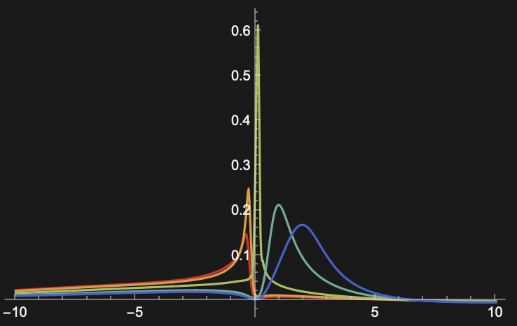

# 2DECFL2ndOrder
This progam computes the two dimensional [Extremely Correlated Fermi Liquid](https://physics-legacy.pbsci.ucsc.edu/~sriram/papers/paper_144.pdf) (ECFL) Theory Green's function to 2nd Order in the $\lambda$ expansion.



# Requirements
This program requires the [GNU gsl](https://www.gnu.org/software/gsl/) and Intel MKL. This program is tested with MKL integrated with [Intel Parallel Studio XE package.](https://www.intel.com/content/www/us/en/developer/articles/guide/download-documentation-intel-parallel-studio-xe-current-previous.html)  


#  Compilation


To compile the program uses the icc compiler. The icc is included in the intel Parallel Studio XE download.  To compile run the following command in the terminal emulator. 
```
$ make CompRhoGParams

```

 
# Usage
$N_\omega = 2^d$ is the length of $\omega$, the frequency array
$L$ is the number lattice site per dimension
$nd$ is the electron density per site
$T$ is the temperature (units $t$)
$t$ is the first neighbor hopping parameter
$tp$ is the second neighbor hopping parameter ($t'$) in units of $t$ 
$J$ is the value of the exchange parameter (units $t$)
$mup$ is first chemical potential
$u0$ is second chemical potential
$neta$ sets the width of the initial green's function
$dom$ is the size of the $\omega$ domain


### To run the program 
```
# parameter set
# d L nd tau tp tpp J mup u0 neta dom 

$ params.out "12 16 0.75 0.057 -0.2 0.0 0.17 -0.78 0.69 7 20"

```


# LICENSE
GSL


